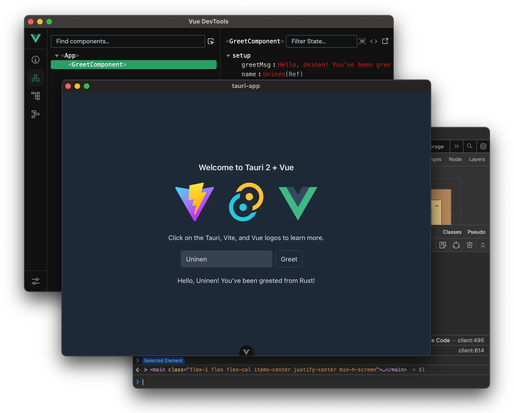

# Tauri + Vue + Vite Template



A production-ready template to build fast, secure desktop apps with Tauri and Vue.

## Features

- **Vue 3 + TypeScript** - Type-safe frontend with devtools
- **Tailwind 4** - CSS preconfigured for native app development
- **Vite** - Fast builds with [AutoImport](https://github.com/antfu/unplugin-auto-import) for cleaner code
- **Vitest** - Unit testing ready to go
- **CI/CD included** - GitHub Actions for automated testing, builds, and releases
- **VS Code ready** - Debugging configs and recommended extensions

## Quick Start

1. Install [Tauri prerequisites](https://tauri.app/start/prerequisites/)
2. Clone and install dependencies:

```sh
pnpm i
```

1. Run the development server (starts both the backend and frontend dev servers and opens the devtools):

```sh
pnpm tauri dev
```

## Project Structure and Usage

A Tauri app has [two processes](https://tauri.app/concept/process-model/):

- **Core Process** (`backend`, or _main_ process in Electron terminology)
- **WebView process** (`frontend`, _renderer_ in Electron)

### Frontend (TS, PnPM)

Frontend code lives in `src/`. See `package.json` for all available commands.

**Testing:**

```sh
pnpm test
```

### Backend (Rust, Cargo)

Backend code lives in `src-tauri/`.

**Finding outdated dependencies** (requires [cargo-outdated](https://github.com/kbknapp/cargo-outdated)):

```sh
cd src-tauri && cargo outdated
```

**Upgrading dependencies** (requires [cargo-edit](https://github.com/killercup/cargo-edit)):

```sh
cd src-tauri && cargo upgrade
```

### Debugging

- The `dev` command has by default `RUST_BACKTRACE=1` set which makes Rust output full backtraces to the console. (Remove it from the `package.json` command if you don't want it).
- If you use VS Code, you can debug Rust code with the included `Debug Tauri` config.

### Building and releasing

#### Building

The project has GitHub Actions set up which will automatically test and build your app with every push and PR. To build manually run:

```sh
pnpm tauri build
```

#### Releasing a new version

1. Bump version number by running `pnpm bump [x.y.z]`
2. Run `pnpm check` to update `Cargo.lock`
3. Tag the commit you want to release with `vX.Y.Z`
4. Edit the release notes and push (also tags!)
5. Github workflow will automatically build a new draft release for this version. Publish when ready 🎉

## Follow Along

- Follow [@uninen on X](https://x.com/uninen) or [uninen.net on Bluesky](https://bsky.app/profile/uninen.net)
- Read my learnings around Tauri / Vue / TypeScript and other Web dev topics from my [Today I Learned blog](https://til.unessa.net/)
- If you speak Finnish, check out [Koneoppiblogi](https://koneoppiblogi.uninen.net)

## Contributing

Contributions are welcome! Please [be nice](./CODE_OF_CONDUCT.md) when interacting with others.
